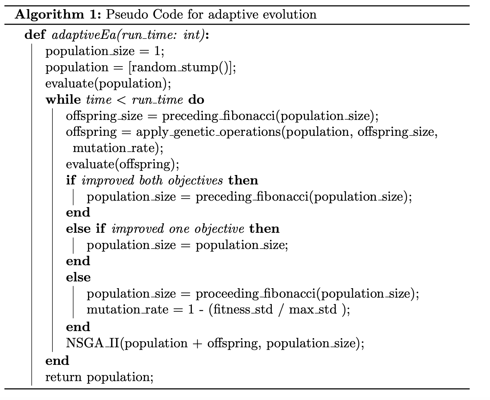

# Adaptive TPOT

This is an (independent) modification of TPOT designed to be largely free of evolutionary hyperparameters. 

Specificially, the population begins as a single randomly chosen estimator, and pipelines are evolved automatically **without** needing to specify

- Population size
- Offspring Size
- Mutation Rate
- Crossover Rate
- Reproduction Rate

The goal is towards further automation in AutoML.
The main changes can be found in [adaptiveEa](https://github.com/ben-ix/tpot-adaptive/blob/master/tpot/gp_deap.py#L178), which is 
the function which drives the evolutionary process. 

The pseudo code for adaptiveEa is



Technical details for this were published in [CEC2020](https://ieeexplore.ieee.org/document/9185770/), a preprint is available on [Arxiv](https://arxiv.org/pdf/2001.10178.pdf)

To cite, please use

```
@INPROCEEDINGS{9185770,
  author={B. {Evans} and B. {Xue} and M. {Zhang}},
  booktitle={2020 IEEE Congress on Evolutionary Computation (CEC)}, 
  title={An Adaptive and Near Parameter-free Evolutionary Computation Approach Towards True Automation in AutoML}, 
  year={2020},
  volume={},
  number={},
  pages={1-8},
}
```


For more information on TPOT (and to cite), please visit the [original authours repository](https://github.com/EpistasisLab/tpot). 
